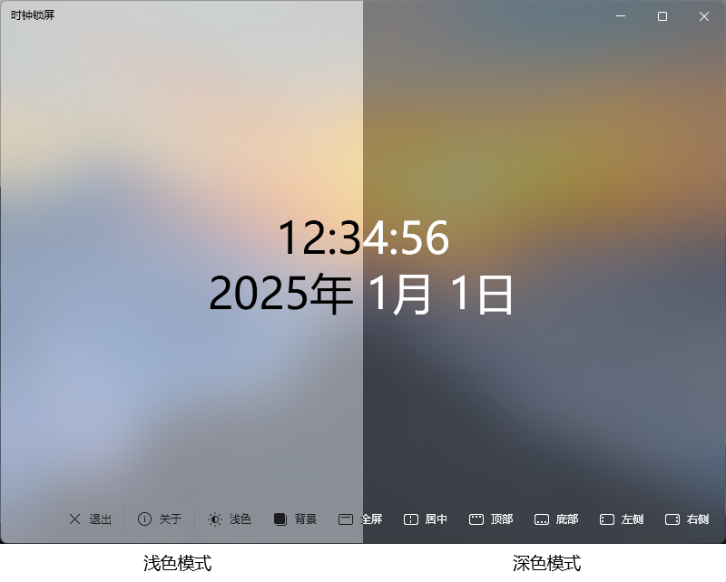

<h1 align="center">
  <a href="https://github.com/cjhdevact/LockTime">LockTime - 时钟锁屏</a>
</h1>

## 📝关于本项目

一个具有深/浅色主题，云母/亚克力背景（需要系统支持），Fluent UI 2界面的时钟锁屏（屏保），支持 Windows 7 及以上版本系统，可以作为屏保使用，也可以自习时在教学白板上使用。

## 💡功能

本程序支持的功能有：

- [x] 显示时间
- [x] 支持改变时间的位置，避免因屏幕被遮挡而导致时间被遮挡问题（支持通过参数启动）
- [x] 支持自定义显示格式
- [x] 支持自定义显示字体、大小、颜色
- [x] 支持窗口/全屏模式
- [x] 多种背景效果，深/浅色主题
- [x] 隐藏底部工具栏（单击时间文字隐藏或显示底部工具栏）

## 🗓️To Do

- [ ] 实现自定义显示时间粗体、斜体、下划线样式，实现时间多行时靠左、居中、靠右选择
- [ ] 把主题和背景移到设置里面

## 📥下载

转到[发布页](https://github.com/cjhdevact/LockTime/releases)下载程序或源代码。

早期版本的程序和源代码也在下载页里。

## 🔑数字签名

本程序使用了自签证书进行了签名

证书信息：
```
Name: CJH Root Certificate
Create: ‎2024‎年‎12‎月‎27‎日 20:42:16
Expires: ‎2150‎年‎12‎月‎31‎日 0:00:00
SHA256: d2d67c8ebea3cc954c7ee0e94f5f45537dde7709053ca9e89f352fda602833e5
SHA1: 73b80a8d0ba3f662b575f2fc0b78612469e22e59
MD5: 0bc507db70947e57ddd81bec63b581d9
Key Number: dbde77418068d5a34b2064626a12ecde
KeyID: d929e453f645017190dac5001a736a4d
Certificate SerialNumber: dbde77418068d5a34b2064626a12ecde
Key fingerprint: 73b80a8d0ba3f662b575f2fc0b78612469e22e59
Key Type: md5RSA
```

你可以在[这里](Src/LockTime/files/rootcert.cer)下载证书来验证程序完整性。

## 🖼️程序截图



## 📄License

本程序基于`GPL-3.0`协议授权。